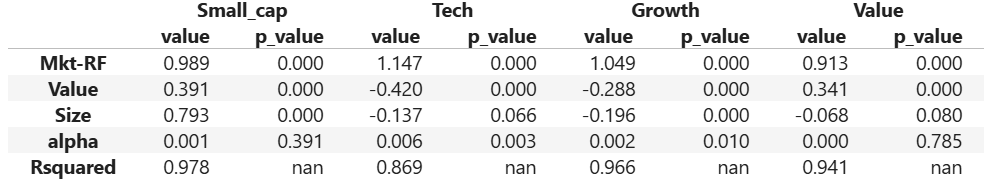

# Fama-French 3 Factors Model : Study of 4 ETF

## Project Overview

The Fama-French 3 Factors Model allows investors to conduct a Factor Analysis in order to analyse the performance of a fund manager or ETF by dissecting past returns over different factors (Market, Size, Value). In this project, we analyse four ETFs from iShares, which target and are highly exposed to at least one of these factors. Results confirmed the targetted exposure of these products, resulting in low alphas and a good fit of the FF3F model. Two portfolio (Technology and Growth) showed positive alphas which we interpret as an hidden technology factor. The selected ETFs provided a relevant framework to assess the model’s fitness and further research could explore factors identification using models such as Principal Component Analysis (PCA).

**Results from the Fama French 3 Factor Model over the selected ETFs:**

## Files included

1. A **Jupyter notebook** ('Fama_French_3Factors.ipynb') containing the theoretical background and the analysis.
3. A **csv file** ('fff_m_ret.csv') including Factors monthly returns, data downloaded from the Kenneth R. French Library.
   
## Python libraries used

- **pandas** : dataframe manipulation.
- **statsmodel.api** : linear regression.
- **yfinance** : financial data collection.

## What I learned through this project

This personal project allowed me to carry out a hands-on practical study covering:
- **Quantitative Finance**: Fama French Model (Factor Analysis) 
- **Supervised Statistics**: Linear Regression
- **Programming**: Python

I implemented a model learnt through a MOOC on a real world fund analysis case.

## Author

**Mathis Lebret** - *Second Year Student in a Joint MSc in Quantitative Finance & Risk Engineering at ISFA Lyon and Ecole Centrale de Lyon.*\
Link to my **[LinkedIn Profile](https://www.linkedin.com/in/mathis-lebret-566952190)**.